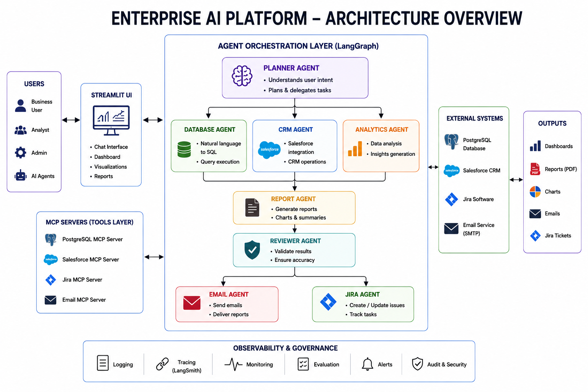
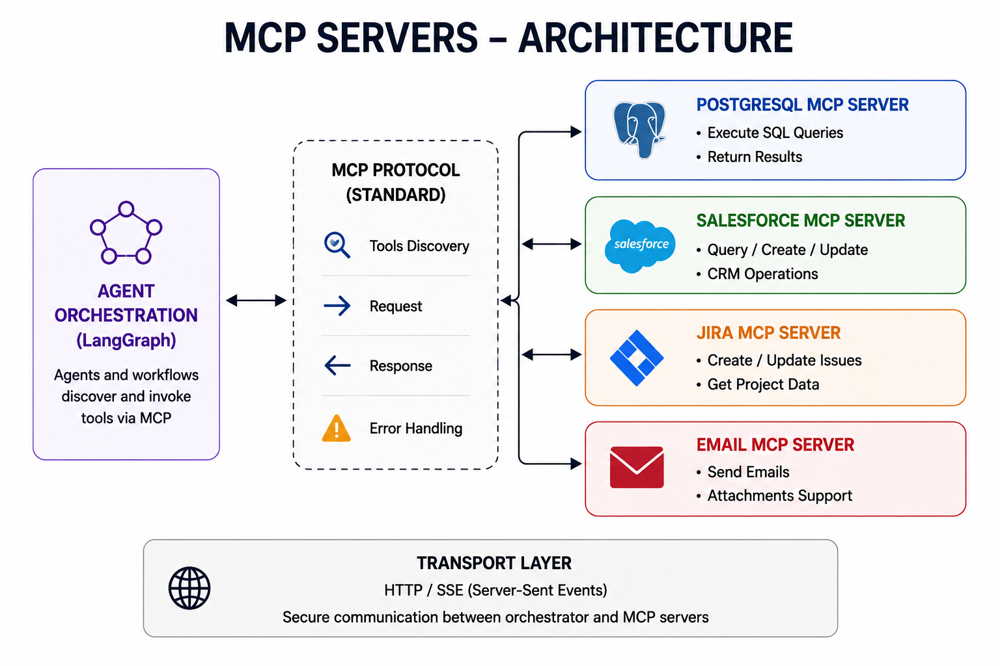
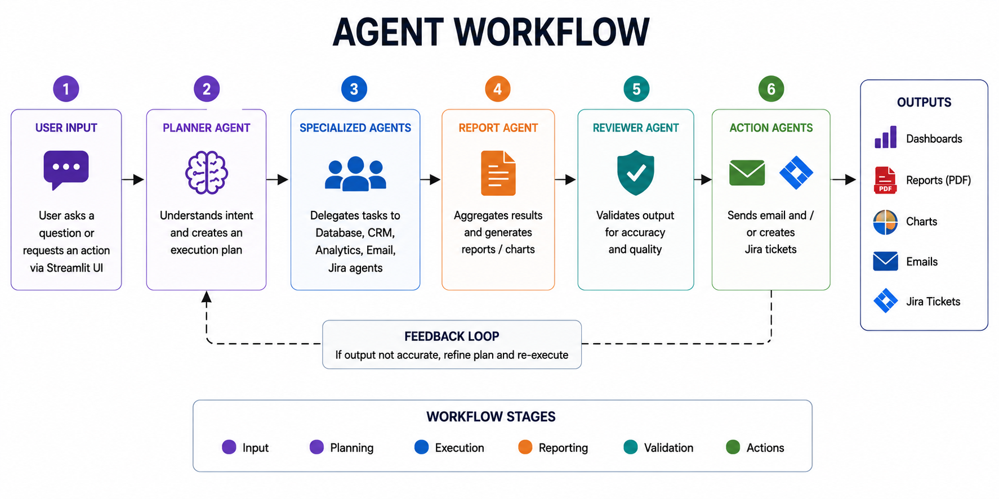

# Enterprise AI Platform

A multi-agent enterprise AI platform that orchestrates specialized AI agents and MCP servers to automate business workflows across PostgreSQL, Salesforce, Email, Jira, reporting, review, and analytics.

## Overview

Enterprise AI Platform enables users to trigger complex business workflows from natural language.

Example:

```text
Generate today's sales report and email it to dapo40@gmail.com

User
 ↓
Streamlit UI
 ↓
Planner Agent
 ↓
Workflow Orchestration
 ├── Database Agent → PostgreSQL MCP → PostgreSQL
 ├── CRM Agent → Salesforce MCP → Salesforce
 ├── Analytics Agent
 ├── Report Agent → PDF Generator
 ├── Reviewer Agent
 ├── Email Agent → Email MCP → Gmail SMTP
 └── Jira Agent → Jira MCP → Jira Cloud

Prompt:
Generate today's sales report and email it to dapo40@gmail.com

Workflow:
Database Agent
 → Analytics Agent
 → Report Agent
 → Reviewer Agent
 → Email Agent
 → Jira Agent
pip install -r requirements.txt

streamlit run app.py

OPENAI_API_KEY=
DATABASE_URL=
EMAIL_ADDRESS=
EMAIL_PASSWORD=
SMTP_SERVER=
SMTP_PORT=
JIRA_URL=
JIRA_EMAIL=
JIRA_API_TOKEN=
SALESFORCE_USERNAME=
SALESFORCE_PASSWORD=
SALESFORCE_SECURITY_TOKEN=


Then save and run:

```bash
git add README.md
git commit -m "Add project README"
git push

## Architecture





